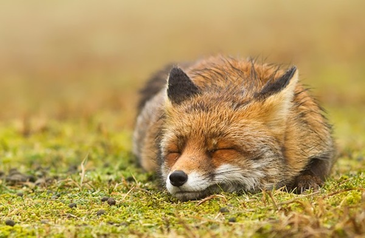

# Project-Rouge 🦊

The home of the Rouge Game Engine

## Overview

This goal of this project is develop a modular game engine. An engine that which will be used by our team to develop our games. The engine is open-source and free to use, so please give it a go if you like what you see and help contribute!

## Examples

One day, in the _(hopefully)_ not too distant future, we'll have some stunning images of the engine in action. Unfortunetly, all we have for now is this Fox, maybe he should be our mascot? 🤔



## Learn 👩🏼‍🏫

The majority of the engine is written in Rust. If you're new to Rust, we highly recommend you check it out! Check out the Rust section below if you want to know more.

The best way to learn the engine will be to look through the example files. You can run them using:

``` shell
cargo run --example example_name
```

Alternatively, you can create a document detailing the entire engine using:

``` shell
cargo doc
```

In the future, we'll host a wiki with more information about the engine, including some of the more complicated nuances of the engine.

## Rust 🦀

Rouge is written in Rust! Everyone's favourite new language. If you'd like to learn about Rust we highly recommend that you check out the [rust-lang.org](http://www.rust-lang.org/) website, it has the latest information and the most up-to-date learning materials.


## The Team 👨🏽‍💻👨🏻‍💻

The team currently consists of two developers, [Alfie](https://www.github.com/Alfie-Edwards) and [Nathan](https://www.github.com/Nefanator). We're Software Engineers from the UK, with an interest is games and the engines that power them. So interested, that we decided to make one together.

